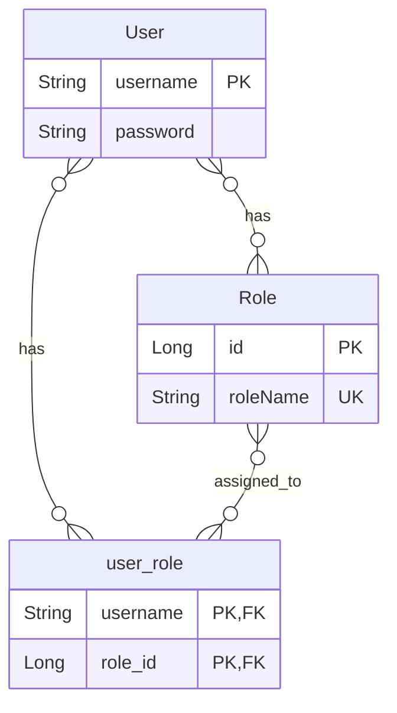
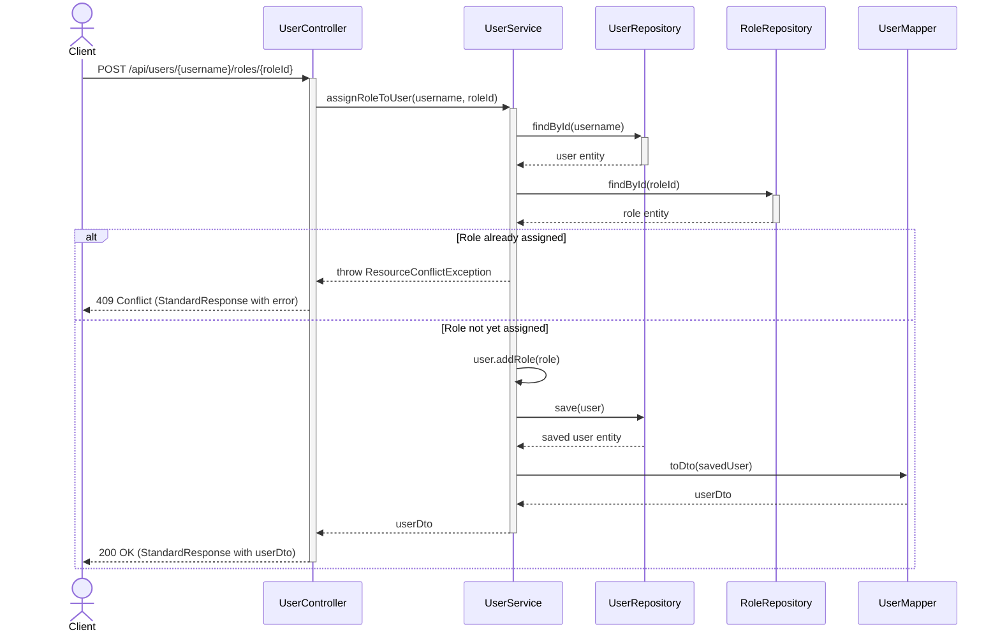

<div dir="rtl">

# תרגיל מעשי - מערכת ניהול משתמשים וסמכויות

## מבוא

במסגרת תרגיל זה תפתחו מערכת מתקדמת לניהול משתמשים וסמכויות באמצעות Spring Boot. המערכת תממש יחסי Many-to-Many בין משתמשים (Users) לתפקידים/סמכויות (Roles) כך שלכל משתמש יכולים להיות מספר תפקידים, ולכל תפקיד יכולים להיות מיוחסים מספר משתמשים.

התרגיל מתבסס על קוד קיים של המשימה הקודמת, ומתמקד בהבנת הארכיטקטורה שלו, תוך הרחבת הפונקציונליות והשלמת המערכת.

##  מפרט דרישות

###  ישויות עיקריות

|  | ישות | תיאור |
|:---:|:---:|---|
|  | **User** | ישות המייצגת משתמש במערכת עם שם משתמש, סיסמה ואוסף תפקידים |
|  | **Role** | ישות המייצגת תפקיד/סמכות במערכת (יחס Many-to-Many עם User) |

###  פונקציונליות נדרשת

####  ניהול משתמשים

| פעולה | תיאור |
|:---:|---|
|  **יצירה** | הוספת משתמש חדש למערכת |
|  **עדכון** | שינוי פרטי משתמש קיים |
|  **מחיקה** | הסרת משתמש מהמערכת |
|  **שליפה** | קבלת פרטי משתמש לפי מזהה |

#### ניהול תפקידים

| פעולה | תיאור |
|:---:|---|
|  **יצירה** | הגדרת תפקיד חדש במערכת |
|  **עדכון** | שינוי פרטי תפקיד קיים |
|  **מחיקה** | הסרת תפקיד מהמערכת |
|  **שליפה** | קבלת פרטי תפקיד לפי מזהה |

####  ניהול הקצאות משתמש-תפקיד

| פעולה | תיאור |
|:---:|---|
|  **הקצאה** | שיוך תפקיד למשתמש |
|  **הסרה** | ביטול שיוך תפקיד ממשתמש |
|  **שליפה** | קבלת כל התפקידים של משתמש מסוים |
|  **סינון** | קבלת כל המשתמשים בעלי תפקיד מסוים |
|  **חיפוש** | קבלת משתמשים ללא תפקידים |

###  תיקוף נתונים

| סוג | תיאור |
|:---:|---|
|  **חובה** | ולידציה של שדות חובה כמו שם משתמש וסיסמה |
|  **אורך** | ולידציה של אורך מינימלי לסיסמה (8 תווים) |
|  **גבולות** | ולידציה של מינימום/מקסימום אורך לטקסטים (3-30 לשם משתמש, 2-50 לשם תפקיד) |

###  טיפול בשגיאות

| מנגנון | תיאור |
|:---:|---|
|  **חריגים** | המערכת תגדיר חריגים מותאמים אישית (ResourceNotFoundException, ResourceConflictException) |
|  **טיפול גלובלי** | המערכת תכלול מנגנון טיפול בחריגים גלובלי (GlobalExceptionHandler) |
|  **תגובה אחידה** | פורמט תגובה אחיד לשגיאות באמצעות StandardResponse |

##  מבנה המערכת

יש לבנות מערכת בארכיטקטורת שכבות (Layered Architecture) לפי המבנה הבא:

| # | שכבה | קבצים | תיאור |
|:---:|:---|:---|:---|
| **1** | **שכבת הישויות** <br>(Entities Layer) |  `User.java`<br> `Role.java` | מחלקות המייצגות את הישויות הבסיסיות במערכת ומגדירות את היחסים ביניהן |
| **2** | **שכבת העברת נתונים** <br>(DTOs Layer) |  `UserDto.java`<br> `RoleDto.java` | אובייקטים להעברת נתונים בין שכבות ללא חשיפת ישויות המידע הפנימיות |
| **3** | **שכבת הגישה לנתונים** <br>(Repositories Layer) |  `UserRepository.java`<br> `RoleRepository.java` | ממשקים המספקים גישה לנתונים ושאילתות מובנות למסד הנתונים |
| **4** | **ממירים** <br>(Mappers) |  `UserMapper.java`<br> `RoleMapper.java` | מחלקות עזר להמרה בין ישויות לאובייקטי העברת נתונים ולהיפך |
| **5** | **שכבת השירותים** <br>(Services Layer) |  `UserService.java` (ממשק)<br> `UserServiceImpl.java` (מימוש)<br> `RoleService.java` (ממשק)<br> `RoleServiceImpl.java` (מימוש) | שכבת הלוגיקה העסקית המטפלת בפעולות ותהליכים על הנתונים |
| **6** | **שכבת הבקרים** <br>(Controllers Layer) |  `UserController.java`<br> `RoleController.java` | ממשקי REST API לקבלת בקשות מהלקוח וניתוב לשירותים המתאימים |
| **7** | **טיפול בשגיאות** <br>(Exception Handling) |  `GlobalExceptionHandler.java`<br> `ResourceNotFoundException.java`<br> `ResourceConflictException.java` | מנגנון לניהול ולתפיסת חריגים והצגתם בצורה אחידה |
| **8** | **פורמט תשובות** <br>(Response Formatting) |  `StandardResponse.java` | מבנה אחיד לכל התגובות מה-API עם שדות לסטטוס, נתונים ושגיאות |

## מבנה נתונים מפורט

### משתמש (User)

| שדה | סוג | תיאור | ולידציה |
|------|------|---------|---------|
| `username` | String | שם משתמש | חובה, ייחודי, 3-30 תווים |
| `password` | String | סיסמה | חובה, מינימום 8 תווים |
| `roles` | Set<Role> | סט תפקידים | ניתן להיות ריק |

### תפקיד (Role)

| שדה | סוג | תיאור | ולידציה |
|------|------|---------|---------|
| `id` | Long | מזהה ייחודי | נוצר אוטומטית |
| `roleName` | String | שם התפקיד | חובה, ייחודי, 2-50 תווים |
| `users` | Set<User> | משתמשים בעלי תפקיד זה | ניתן להיות ריק |

## יחסים בין הישויות

</div>



<div dir="rtl">

### יחס User ↔ Role
* סוג יחס: **Many-to-Many**
* משתמש יכול להיות בעל מספר תפקידים, וכל תפקיד יכול להיות משויך למספר משתמשים.
* טבלת קישור: `user_role`
* מימוש:
    * `ManyToMany@` בישות `User` עם `JoinTable`
    * `ManyToMany(mappedBy="roles")@` בישות `Role`

## דוגמאות למימוש

### 1. שכבת הישויות (Entities)

**User.java** (קטע נבחר):

</div>

<div dir="ltr">

```java
@Entity
@Table(name = "users")
public class User {
    @Id
    @Column(unique = true, nullable = false, length = 30)
    private String username;

    @Column(nullable = false)
    private String password;

    @ManyToMany(fetch = FetchType.LAZY)
    @JoinTable(
            name = "user_role",
            joinColumns = @JoinColumn(name = "username"),
            inverseJoinColumns = @JoinColumn(name = "role_id")
    )
    private Set<Role> roles = new HashSet<>();

    // Helper methods for managing relationships
    public void addRole(Role role) {
        roles.add(role);
        role.getUsers().add(this);
    }

    // ...
}
```

</div>

<div dir="rtl">

**Role.java** (קטע נבחר):

</div>

<div dir="ltr">

```java
@Entity
@Table(name = "roles")
public class Role {
    @Id
    @GeneratedValue(strategy = GenerationType.IDENTITY)
    private Long id;

    @Column(name = "role_name", unique = true, nullable = false)
    private String roleName;

    @ManyToMany(mappedBy = "roles", fetch = FetchType.LAZY)
    private Set<User> users = new HashSet<>();

    // ...
}
```

</div>

<div dir="rtl">

### 2. שכבת DTO (Data Transfer Objects)

**UserDto.java** (קטע נבחר):

</div>

<div dir="ltr">

```java
@Data
public class UserDto {
    @NotBlank(message = "Username must not be blank")
    @Size(min = 3, max = 30, message = "Username must be between 3 and 30 characters")
    private String username;

    @NotBlank(message = "Password must not be blank")
    @Size(min = 8, message = "Password must be at least 8 characters")
    private String password;

    private Set<Long> roleIds = new HashSet<>();

    // ...
}
```

</div>

<div dir="rtl">

### 3. שכבת המאגרים (Repositories)

**UserRepository.java**:

</div>

<div dir="ltr">

```java
@Repository
public interface UserRepository extends JpaRepository<User, String> {
    List<User> findByRolesId(Long roleId);
    List<User> findByRolesIsEmpty();
}
```

</div>

<div dir="rtl">

### 4. דוגמה למימוש שירותים (Services)

**UserServiceImpl.java** (קטע נבחר - הקצאת תפקיד למשתמש):

</div>

<div dir="ltr">

```java
@Service
public class UserServiceImpl implements UserService {
    // ...

    @Override
    @Transactional
    public UserDto assignRoleToUser(String username, Long roleId) {
        User user = userRepository.findById(username)
                .orElseThrow(() -> ResourceNotFoundException.createForUser(username));

        Role role = roleRepository.findById(roleId)
                .orElseThrow(() -> ResourceNotFoundException.createForRole(roleId));

        // Check if user already has this role
        if (user.getRoles().contains(role)) {
            throw new ResourceConflictException("Role is already assigned to this user");
        }

        user.addRole(role);
        User updatedUser = userRepository.save(user);
        return userMapper.toDto(updatedUser);
    }

    // ...
}
```

</div>

<div dir="rtl">

### 5. דוגמה לבקר (Controller)

**UserController.java** (קטע נבחר):

</div>

<div dir="ltr">

```java
@RestController
@RequestMapping("/api/users")
public class UserController {
    // ...

    // Assign role to user
    @PostMapping("/{username}/roles/{roleId}")
    public ResponseEntity<StandardResponse> assignRoleToUser(
            @PathVariable String username,
            @PathVariable Long roleId) {
        return ResponseEntity.ok(
                new StandardResponse(
                        "success",
                        userService.assignRoleToUser(username, roleId),
                        null
                )
        );
    }

    // ...
}
```

</div>

<div dir="rtl">

### 6. דוגמה לטיפול בחריגים

**GlobalExceptionHandler.java** (קטע נבחר):

</div>

<div dir="ltr">

```java
@RestControllerAdvice
public class GlobalExceptionHandler {

    @ExceptionHandler(ResourceNotFoundException.class)
    public ResponseEntity<StandardResponse> handleResourceNotFoundException(ResourceNotFoundException ex) {
        Map<String, String> error = new HashMap<>();
        error.put("type", "Resource Not Found");
        error.put("message", ex.getMessage());

        return ResponseEntity
                .status(HttpStatus.NOT_FOUND)
                .body(new StandardResponse("error", null, error));
    }

    // ...
}
```

</div>

<div dir="rtl">

## תרשים רצף: הקצאת תפקיד למשתמש

</div>



<div dir="rtl">

## דוגמאות לשאילתות HTTP

### יצירת משתמש חדש

</div>

<div dir="ltr">

```http
POST /api/users HTTP/1.1
Host: localhost:8080
Content-Type: application/json

{
  "username": "john_doe",
  "password": "Password123!",
  "roleIds": [1, 2]
}
```

</div>

<div dir="rtl">

### הקצאת תפקיד למשתמש

</div>

<div dir="ltr">

```http
POST /api/users/john_doe/roles/3 HTTP/1.1
Host: localhost:8080
Content-Type: application/json
```

</div>

<div dir="rtl">

### קבלת משתמשים ללא תפקידים

</div>

<div dir="ltr">

```http
GET /api/users/withoutRoles HTTP/1.1
Host: localhost:8080
Accept: application/json
```

</div>

<div dir="rtl">

##  אופציה: משימות הרחבה לתרגיל

| # | משימה | פירוט | רמת קושי |
|:---:|:---|:---|:---:|
| **1** | **ניתוח הקוד הקיים** | • התבונן בקבצי הקוד הקיימים והבן את הארכיטקטורה הכוללת של המערכת<br>• זהה את ההתאמות בין שכבות שונות (entities, DTOs, repositories, services, controllers)<br>• הכר את הלוגיקה העסקית הקיימת ואת מבנה ה-API | 1 |
| **2** | **השלמת פונקציונליות חסרה** | • הוסף אפשרות לקבל את כל התפקידים עבור משתמש מסוים (באמצעות endpoint נפרד)<br>• הוסף endpoint לחיפוש משתמשים לפי חלק משם המשתמש<br>• הוסף ולידציה נוספת לשדות הקיימים | 2 |
| **3** | **הרחבת המערכת** | • הוסף שדה `description` לישות `Role` לתיאור התפקיד<br>• הוסף אפשרות לסינון משתמשים לפי מספר תפקידים (פחות/יותר מ-X תפקידים)<br>• הוסף יכולת לסדר את תוצאות השאילתות לפי שדות שונים (מיון) | 3 |
| **4** | **שיפור ניהול החריגים** | • הוסף חריג מותאם חדש למצבים של נתונים לא תקינים (`InvalidDataException`)<br>• הרחב את ה-`GlobalExceptionHandler` לטפל בחריג החדש<br>• ודא טיפול אחיד ועקבי בכל סוגי השגיאות | 2 |

###  יעדי הגשה

1. **קוד מקור** - כל הקבצים המעודכנים בארגון תיקיות תקני
2. **README** - קובץ הסבר מקיף על הפתרון והשינויים שבוצעו
3. **בדיקות** - כלל הבדיקות עוברות בהצלחה
4. **תיעוד API** - תיעוד מלא של כל ה-endpoints החדשים והקיימים
5. **הערות** - הערות הבהרה לגבי בחירות עיצוב ומימוש

## פורמט הגשה

יש להגיש את הפרויקט כקובץ ZIP הכולל:
1. קוד המקור המלא.
2. קובץ README עם הסבר על הפתרון.
3. הסברים לגבי אופן ההרצה והבדיקה של המערכת.

## קריטריונים להערכה

* יישום נכון של ארכיטקטורת שכבות
* מימוש תקין של יחסי Many-to-Many
* תיקוף נתונים מקיף ונכון
* טיפול נאות בשגיאות
* איכות הקוד, תחזוקתיות וקריאות
* תיעוד ברור ומקיף

בהצלחה!

</div>